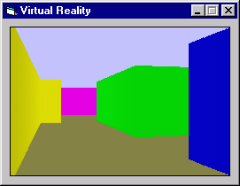



## A 3D Virtual Reality

### Description

This example shows how to render Three Dimensional enviornments using pure VB code. You may also customize the map by editing the included text file. Use the arrow keys to control your movement, and the < > keys to strafe.
 
### More Info
 

             |
---                |---
**Submitted On**   |2003-04-02 10:47:32
**By**             |[Jason K\. Resch](https://github.com/Planet-Source-Code/PSCIndex/blob/master/ByAuthor/jason-k-resch.md)
**Level**          |Intermediate
**User Rating**    |4.6 (78 globes from 17 users)
**Compatibility**  |VB 4\.0 \(32\-bit\), VB 5\.0, VB 6\.0
**Category**       |[Graphics](https://github.com/Planet-Source-Code/PSCIndex/blob/master/ByCategory/graphics__1-46.md)
**World**          |[Visual Basic](https://github.com/Planet-Source-Code/PSCIndex/blob/master/ByWorld/visual-basic.md)
**Archive File**   |[A\_3D\_Virtu156798422003\.zip](https://github.com/Planet-Source-Code/jason-k-resch-a-3d-virtual-reality__1-44421/archive/master.zip)

